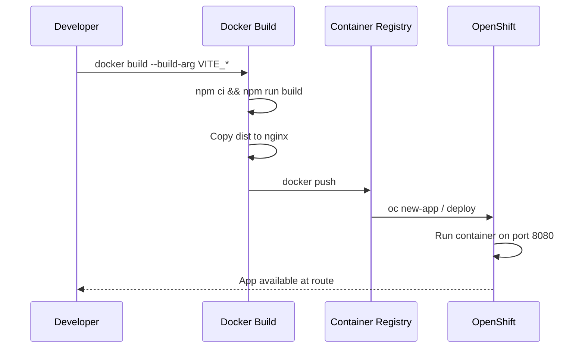

# Sound Check

Network monitoring application for tracking latency and availability.

## Project Info

**URL**: https://lovable.dev/projects/REPLACE_WITH_PROJECT_ID

## Technologies

- Vite
- TypeScript
- React
- shadcn-ui
- Tailwind CSS
- Supabase (Lovable Cloud)

---

## Development

### Prerequisites

- Node.js & npm - [install with nvm](https://github.com/nvm-sh/nvm#installing-and-updating)

### Local Development

```sh
# Clone the repository
git clone <YOUR_GIT_URL>
cd <YOUR_PROJECT_NAME>

# Install dependencies
npm i

# Start development server
npm run dev
```

---

## Docker Deployment (OpenShift)

This application is containerized for deployment on OpenShift using a multi-stage Docker build.

### Architecture



### Build the Docker Image

Build-time environment variables must be passed as `--build-arg` since Vite embeds them into the JavaScript bundle:

```bash
docker build \
  --build-arg VITE_SUPABASE_URL="https://your-project.supabase.co" \
  --build-arg VITE_SUPABASE_PUBLISHABLE_KEY="your-anon-key" \
  --build-arg VITE_SUPABASE_PROJECT_ID="your-project-id" \
  -t soundcheck-app:latest .
```

### Run Locally for Testing

```bash
docker run -p 8080:8080 soundcheck-app:latest
```

Then open http://localhost:8080 in your browser.

### Push to Container Registry

```bash
# Tag for your registry
docker tag soundcheck-app:latest your-registry.com/soundcheck-app:latest

# Push
docker push your-registry.com/soundcheck-app:latest
```

### Deploy to OpenShift

```bash
# Create new app from image
oc new-app your-registry.com/soundcheck-app:latest

# Expose the service as a route
oc expose svc/soundcheck-app

# Get the route URL
oc get route soundcheck-app
```

### Environment Variables Reference

| Variable | Required | Description |
|----------|----------|-------------|
| `VITE_SUPABASE_URL` | Yes | Supabase project URL |
| `VITE_SUPABASE_PUBLISHABLE_KEY` | Yes | Supabase anon/public key |
| `VITE_SUPABASE_PROJECT_ID` | Yes | Supabase project ID |

See `.env.example` for the full template.

### Technical Notes

- **Port 8080**: OpenShift runs containers as non-root; port 8080 is above 1024 and doesn't require root
- **Build-time variables**: Vite embeds `VITE_*` variables at build time, so different environments need separate image builds
- **SPA routing**: Nginx is configured with `try_files $uri /index.html` for React Router support

---

## Poller Service

The `poller-service/` directory contains a standalone Node.js service for real network polling. See `poller-service/README.md` for deployment instructions.

---

## Editing the Code

- **Lovable**: Visit the [Lovable Project](https://lovable.dev/projects/REPLACE_WITH_PROJECT_ID) and start prompting
- **Local IDE**: Clone the repo and push changes
- **GitHub**: Edit files directly or use Codespaces
