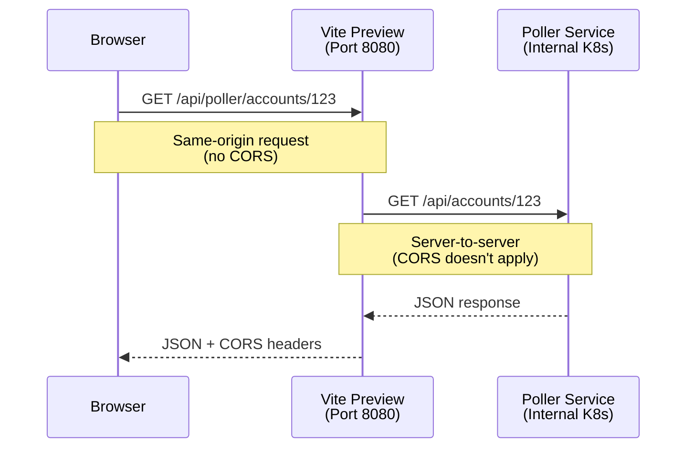
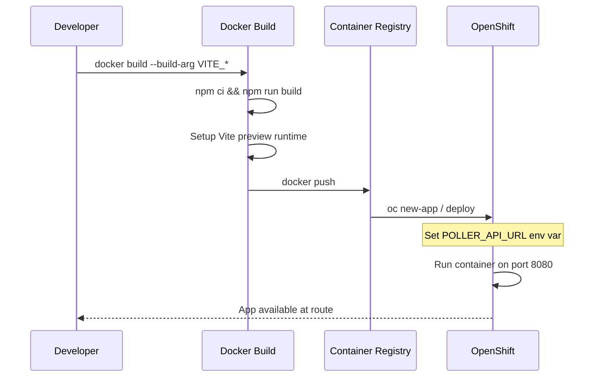

# Sound Check

Network monitoring application for tracking latency and availability.

## Project Info

**URL**: https://lovable.dev/projects/REPLACE_WITH_PROJECT_ID

## Technologies

- Vite
- TypeScript
- React
- shadcn-ui
- Tailwind CSS
- Supabase (Lovable Cloud)

---

## Development

### Prerequisites

- Node.js & npm - [install with nvm](https://github.com/nvm-sh/nvm#installing-and-updating)

### Local Development

```sh
# Clone the repository
git clone <YOUR_GIT_URL>
cd <YOUR_PROJECT_NAME>

# Install dependencies
npm i

# Start development server
npm run dev
```

### Testing with Proxy Locally

To test the production proxy behavior locally:

```sh
# Build the app
npm run build

# Run preview with proxy (simulating production)
POLLER_API_URL=http://localhost:3001 npm run preview

# Or without proxy (uses mock fallback)
npm run preview
```

---

## Docker Deployment (OpenShift)

This application is containerized for deployment on OpenShift using a multi-stage Docker build with Vite preview server for production.

### Architecture

The frontend uses a **server-side proxy** to bypass CORS restrictions when calling internal APIs:



### Build & Deploy Flow



### Build the Docker Image

Build-time environment variables must be passed as `--build-arg` since Vite embeds them into the JavaScript bundle:

```bash
docker build \
  --build-arg VITE_SUPABASE_URL="https://your-project.supabase.co" \
  --build-arg VITE_SUPABASE_PUBLISHABLE_KEY="your-anon-key" \
  --build-arg VITE_SUPABASE_PROJECT_ID="your-project-id" \
  -t soundcheck-app:latest .
```

### Run Locally for Testing

```bash
# Without proxy (uses mock data)
docker run -p 8080:8080 soundcheck-app:latest

# With proxy (connects to local poller service)
docker run -p 8080:8080 \
  -e POLLER_API_URL="http://host.docker.internal:3001" \
  soundcheck-app:latest
```

Then open http://localhost:8080 in your browser.

### Push to Container Registry

```bash
# Tag for your registry
docker tag soundcheck-app:latest your-registry.com/soundcheck-app:latest

# Push
docker push your-registry.com/soundcheck-app:latest
```

### Deploy to OpenShift

```bash
# Create new app from image
oc new-app your-registry.com/soundcheck-app:latest

# Set runtime environment variable for proxy
oc set env deployment/soundcheck-app \
  POLLER_API_URL="http://soundcheck-poller.soundcheck.svc.cluster.local:3001"

# Expose the service as a route
oc expose svc/soundcheck-app

# Get the route URL
oc get route soundcheck-app
```

### Environment Variables Reference

| Variable | Type | Required | Description |
|----------|------|----------|-------------|
| `VITE_SUPABASE_URL` | Build-time | Yes | Supabase project URL |
| `VITE_SUPABASE_PUBLISHABLE_KEY` | Build-time | Yes | Supabase anon/public key |
| `VITE_SUPABASE_PROJECT_ID` | Build-time | Yes | Supabase project ID |
| `POLLER_API_URL` | Runtime | Yes* | Internal URL for poller service proxy |

*Required for real API access; without it, the proxy returns 503 and the app uses mock data.

See `.env.example` for the full template.

### OpenShift ConfigMap Example

```yaml
apiVersion: v1
kind: ConfigMap
metadata:
  name: soundcheck-config
data:
  POLLER_API_URL: "http://soundcheck-poller.soundcheck.svc.cluster.local:3001"
---
apiVersion: apps/v1
kind: Deployment
metadata:
  name: soundcheck-app
spec:
  template:
    spec:
      containers:
        - name: soundcheck-app
          envFrom:
            - configMapRef:
                name: soundcheck-config
```

### Technical Notes

- **Port 8080**: OpenShift runs containers as non-root; port 8080 is above 1024 and doesn't require root
- **Build-time variables**: Vite embeds `VITE_*` variables at build time, so different environments need separate image builds
- **Runtime variables**: `POLLER_API_URL` is read by the Vite preview server at startup
- **SPA routing**: Vite preview handles client-side routing automatically
- **Proxy middleware**: `/api/poller/*` requests are forwarded server-side to `POLLER_API_URL/api/*`

---

## Poller Service

The `poller-service/` directory contains a standalone Node.js service for real network polling. See `poller-service/README.md` for deployment instructions.

---

## Editing the Code

- **Lovable**: Visit the [Lovable Project](https://lovable.dev/projects/REPLACE_WITH_PROJECT_ID) and start prompting
- **Local IDE**: Clone the repo and push changes
- **GitHub**: Edit files directly or use Codespaces
